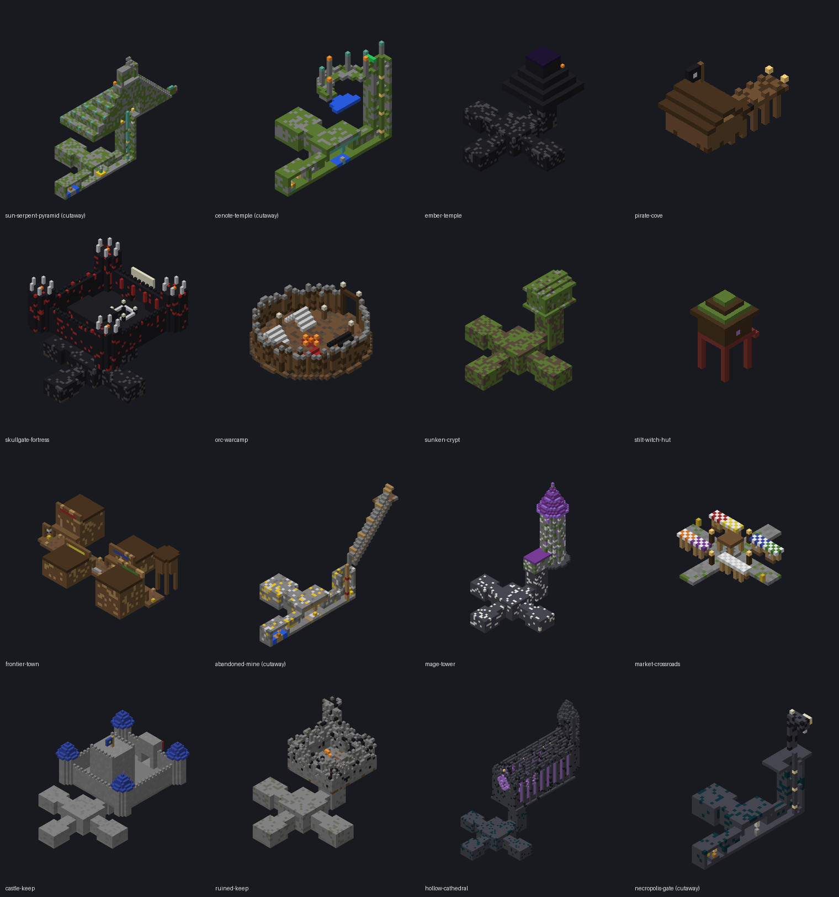

# Sundered Realms — an Iris world pack for Minecraft 26.2

*Long ago the Crown of Aerthos shattered, and the world broke with it into drifting continents
separated by warm, crossable seas.*

Sundered Realms is a dimension for [Iris](https://github.com/VolmitSoftware/Iris). It is built as an
overlay on the official Iris **overworld** pack, which is the folder you keep at
`C:\Users\William Turturici\Downloads\overworld`. That pack supplies the trees, clutter, snippets,
ores, caves, rivers and vanilla structures. This pack adds a new dimension, 8 realms (regions),
38 hand-tuned biomes, custom terrain generators, 37 original structures (12 with underground
dungeons), themed loot tables and named monster spawners.



## The realms

The dimension makes fewer, larger continents than the overworld (`continentZoom 1.9`,
`landChance 0.52`) separated by open but crossable ocean. Realms are continent-scale
(`regionZoom 24`), so a voyage usually lands you somewhere new. The Azure Isles are twice as common as
any other realm.

| Realm | Feel | Biomes | Signature places |
|---|---|---|---|
| **The Azure Isles** | Caribbean islands: turquoise shallows, white sand, palms, volcanoes | Palm Cays, Serpent Jungle Highlands, Cenote Jungle, Mangrove Lagoon, Emberpeak Volcano, Ember Slopes, White Sand Beach, Turquoise Shallows (coral reefs with islets) | **Sun-Serpent Pyramid** (Mayan step pyramid: summit temple, ladder shaft to a burial chamber, spiral stair to the Crypt of the Serpent Kings), **Cenote Temple** (sacred well with a drowned sanctum), **Ember Temple** (obsidian ziggurat with a lava forge vault), volcano **calderas** with lava lakes on the peaks, **Pirate Coves**, jungle shrines, serpent stelae, procedural ruins |
| **Ashfang Reach** | Orc-corrupted wasteland | Blighted Wastes, Bloodrock Crags (blood-red spires and hoodoos), Cinder Fields (cratered ash), Rotwood Thicket | **Skullgate Fortress** (blackstone war-fort with a skull gate; "The Maw" prison pits beneath), **Orc Warcamps** (palisade, hide tents, bonfire, skull pikes, cages), blood altars, bone totems |
| **The Dreadmire** | Bogs and swamps | Blackwater Bog, Murkwood Swamp, Drowned Fen (pale moss, creaking pale oaks), Mudflats | **Sunken Crypt** (mossy mausoleum over a flooded crypt), stilt witch huts, drowned shrines, hanging gibbets |
| **The Sunscorch Frontier** | Western fantasy and cracked dry lands | Cracked Flats (polygon-cracked mudplates with real fissures), Red Mesa (terraces, hoodoos, stone arches), Sagebrush Prairie, Deadwood Canyon | **Frontier Town** (saloon, sheriff's jail, general store, bank, water tower, gallows), **Abandoned Mine** (rail adit into the Deepvein galleries), **Sun Oracle** (golden sun-disc shrine over the Vault of Noon), bandit forts, longhorn markers |
| **The Everbloom** | Places of life and magic | Glimmerwood (fireflies, glowcaps, cherry and azalea), Crystal Meadow (amethyst geodes), Elder Grove (buttress-rooted giants), Fae Shore | **Mage Tower** (violet spire with library, alchemy and enchanting floors; an arcane vault below), fairy rings, moonwells, arcane henges |
| **The Crownlands** | High fantasy: trade and kingdoms | Golden Fields, Rolling Downs, Kingswood, Harbor Coast | **Castle Keep** (curtain walls, towers, gatehouse, undercroft treasury), **Market Crossroads** (well and eight trade stalls), watchtowers, windmills, lighthouses |
| **The Warscar Marches** | War-torn | Scorched Battlefield (craters, rubble, broken walls), Ruined Marches, Ashen Woods | **Ruined Keep** (shattered fortress over sealed siege vaults), broken trebuchets, war graves, burned houses |
| **The Umbral Peaks** | High dark fantasy | Gravespire Peaks (jagged deepslate spires), Deadpine Vale, Cathedral Heights | **Hollow Cathedral** (ruined gothic nave with a rose window and bell tower; the Ossuary Catacombs below), **Necropolis Gate**, soulfire obelisks, gibbet cages |

### Dungeons
Every dungeon is entered from a building or opening at ground level. A spiral stair shaft,
lit by a glowing core column, drops 15–30 blocks into a themed complex. The complex has a pillared
central hall with a centerpiece and three side chambers, chosen per theme from treasure vault, crypt,
shrine, prison, armory, library, forge, altar and flooded chamber. Rooms are cut with `void_air`,
the block Iris uses to carve space out of terrain, so they form real hollow spaces
underground. They are unlit, so mobs spawn in them naturally.

### Loot
Structure chests use this pack's loot tables together with fitting vanilla tables: jungle temple,
buried treasure, pillager outpost, bastion, ancient city, stronghold and others. They also include
named relics, for example *Fang of Kukul-Vaan*, *Skullsplitter*, *Hag's Sickle*,
*Old Faithful*, *Tome of the First Bloom* and *Grief, Blade of the Hollow King*.

### Monsters
Each realm has its own spawners: Ashfang Orcs, Brutes, Skirmishers and Direwolves; Bog Wights, Mire Hags
and Fen-Drowned; Desperados and Dust Revenants; Jade Sentinels and Sunken Buccaneers; Fallen
Soldiers and Oathbreaker Deserters; Grave Knights and Hollow Revenants. Friendlier realms get
Will-o'-Wisps, Fae Foxes, Travelling Merchants and Crown Sentries.

## Install (Windows)

Requirements: a Paper/Spigot server for Minecraft **26.2** with a current Iris build, and your Iris
`overworld` pack folder (a recent version; this pack was built against overworld v4013).

```powershell
cd <this repo>\iris-packs\sundered-realms
powershell -ExecutionPolicy Bypass -File .\install.ps1 -Server "C:\path\to\your\server"
# -Source defaults to C:\Users\William Turturici\Downloads\overworld
```

The script copies your overworld folder to `plugins\Iris\packs\sundered-realms`, overlays this pack,
and removes the copied `overworld.json` dimension. Your original folder is not modified.
Then run, in game or from the console:

```
/iris create name=aerthos type=sundered-realms
/iris studio open sundered-realms      # optional: live preview and editing in Iris Studio
```

To make it the main world, set it in `bukkit.yml`:

```yaml
worlds:
  world:
    generator: Iris:sundered-realms
```

On Linux or macOS: `./install.sh <overworld-folder> <server-folder> [--force]`.

## Tuning
All content is generated by the scripts in `tools/`, so change a number there and rebuild:

| Want | Change |
|---|---|
| Larger or smaller continents | `continentZoom` / `landChance` in `build_pack.py` → `main()` |
| Larger or smaller realms | `regionZoom` in `main()`, and `landBiomeZoom` per realm in the `zones` list |
| More or fewer of a structure | the `chance` argument of its `structure(...)` call (chance per chunk in that biome) |
| A realm more or less common | the realm's `rarity` in the `zones` list (1 = common, higher = rarer) |
| Edit a building | its builder function in `tools/structures.py` |

```bash
python3 tools/build_objects.py            # writes pack/objects/sundered/**.iob + tools/objects-manifest.json
python3 tools/build_pack.py --base <overworld-folder>
./check.sh [overworld-folder]              # rebuild + validate against the latest Iris source
```

## How it was validated, and what wasn't tested
* `check.sh` extracts every config class and field from the Iris engine source, then checks each generated
  JSON file. It flags unknown keys, wrong types and invalid enum values (noise styles, place modes,
  tree profiles, …). It also resolves every reference: biomes, regions, generators, snippets,
  objects, loot tables, spawners and entities. Result: 0 errors. The only warnings are stale keys inside
  the official overworld snippets, which Iris ignores.
* Every `.iob` is written in the Iris V2 object format and read back to check it round-trips.
  Block IDs and block-state properties were checked against those used by the official pack.
  `chain` was updated to its 26.x name, `iron_chain`.
* **Not done:** generating a world in a running 26.2 server. The build container could not
  download the Minecraft server or the Iris build dependencies. Expect to tune rarities and heights
  after your first look in `/iris studio`. The volcano cones (`CELLULAR_HEIGHT` + `CRATER`
  noise) and the cracked-flats fissures are the parts most worth checking visually.

## Layout
```
pack/                    overlay copied on top of the overworld pack
  dimensions/sundered-realms.json
  regions/sundered/*.json      8 realms
  biomes/sundered/<realm>/*    38 biomes
  generators/sundered/*        cay, volcano-cone, bog, mesa-terrace, craters, gravespires
  objects/sundered/<realm>/*   37 structures (.iob)
  loot/ spawners/ entities/    loot tables, spawners, named monsters
tools/                   voxel builder, structure designs, pack generator, schema validator
install.ps1 / install.sh / check.sh
```

The official overworld pack this builds on is public domain (Unlicense).
